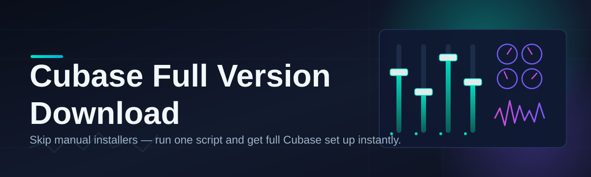

# cubase-full-version-manager 🎛️🚀

  

*A weekend project that grew into the tidiest way to organize, track, and launch your Cubase full version download workflow — no nonsense, no bloat.*

  

## 🧭 What this is NOT

It's NOT a launcher that promises magic. It's NOT a shady toolbox full of sketchy scripts. It's NOT going to ping you fifteen times a day about "premium upgrades." I built this because I was tired of juggling a dozen browser tabs, half-finished notes, and a graveyard of installer `.exe` files every time I needed to manage a Cubase full version download for a new machine or a studio rebuild.

What it **IS**: a clean, focused Windows companion app that helps you organize download sessions, verify file integrity, track version history, and get your Cubase setup running with the least amount of friction humanly possible. Think of it as the mission control panel I wish existed when I started producing — a single pane of glass between "I need Cubase" and "I'm making music."

## 🎧 Overview

Let's be honest — the world of DAW installers is a mess. Version numbers everywhere, mirrors that die mid-download, changelogs buried three forum pages deep, and installers that leave orphaned files scattered across your drive like confetti after a party nobody remembers throwing. `cubase-full-version-manager` exists to bring order to that chaos specifically around the **Cubase full version download** experience — the searching, the verifying, the organizing, and the eventual "okay it's actually running now" moment.

This tool is for home producers rebuilding a PC, studio techs provisioning multiple workstations, hobbyists who just want a dependable reference point, and anyone who's ever screamed at a stalled download bar at 2 AM. It doesn't try to be a DAW itself — it respects that Cubase is Steinberg's domain — it's the **logistics layer** around getting your full version download organized, versioned, and launch-ready without babysitting seventeen browser tabs.

I built the first version in a single weekend fueled by cold coffee and mild frustration. It kept growing because, apparently, a lot of people share my frustration. So here we are — a proper little project with a proper little README, and I'm still proud of it every time someone opens an issue instead of ragequitting.

> [!TIP]
> Bookmark the landing page above — that's the single source of truth for the current build. Everything else is documentation, not distribution.

## 🔥 Why People Actually Keep This Installed

- **Session Memory that doesn't forget** — every Cubase full version download attempt gets logged with timestamp, source, and status, so you never wonder "did I already grab this one?"

- **Integrity Checks baked in** — automatic checksum verification means you're not left guessing whether that installer is actually complete or just *pretending* to be 4GB.

- **Version Timeline view** — a visual ledger of every Cubase build you've tracked, so upgrading or rolling back is a decision, not an archaeology dig.

- **One-Click Resume** — stalled downloads pick up where they left off instead of restarting from zero like it's 2009 dial-up again.

- **Local-Only Footprint** — no background telemetry phoning home, no mystery processes eating your CPU while you're trying to mix.

- **Smart Folder Structuring** — automatically organizes installers and related assets into predictable folders so your Downloads directory stops looking like a crime scene.

- **Dark & Light Themes** — because staring at a blinding white UI at midnight while chasing a Cubase full version download is a special kind of self-punishment.

- **Portable Mode** — run it off a USB stick when you're setting up a friend's rig and don't want to "install yet another thing."

## 🚦 How to Get Started

1. Visit the landing page via the download button above — that's the only official source.

2. Grab the latest build for your Windows version (10 or 11, both fully supported).

3. Run the standalone executable — no installer wizard, no dependency chase, no admin ritual required.

4. Open the app, point it at your workspace folder, and let the Session Memory take over from there.

> [!NOTE]
> First launch takes a few seconds longer while the app builds its local index. That's normal — it's not frozen, it's just being thorough.

## 🧩 System Requirements

| Requirement       | Minimum                         | Recommended                     |
|--------------------|----------------------------------|----------------------------------|
| OS                 | Windows 10 (64-bit)              | Windows 11 (64-bit)              |
| RAM                | 4 GB                              | 8 GB+                            |
| Disk Space         | 250 MB free (app only)           | 500 MB+ (with logs/cache)        |
| Dependencies       | None — fully standalone          | None                              |
| .NET / Runtime     | Bundled, nothing to install      | Bundled                          |

> [!IMPORTANT]
> This is a standalone tool. No hidden dependency installs, no silent background frameworks. What you download is what runs.

## ⚙️ How It Works

The architecture is intentionally boring — boring is reliable:

1. **Discovery** — the app scans your configured sources and mirrors for available Cubase build metadata.

2. **Session Creation** — a new tracked session is created the moment you start a Cubase full version download.

3. **Verification** — checksums are computed and compared against known-good hashes automatically.

4. **Indexing** — completed downloads get filed into your organized folder structure and logged in the version timeline.

5. **Launch-Ready State** — the app flags the installer as verified and ready, so you know exactly when it's safe to run.

## 🛟 Troubleshooting

**Q: The download shows "stalled" but the progress bar isn't moving. What now?**
A: Pause and resume the session manually — the resume engine sometimes needs a nudge if the source mirror rate-limits idle connections.

**Q: My antivirus flagged the executable on first run.**
A: Standalone `.exe` files without a heavyweight installer sometimes trip heuristic scanners. Check the SHA256 hash listed on the landing page against your local file before proceeding.

**Q: Can I run two version sessions simultaneously?**
A: Yes — the Session Memory system is designed for concurrent tracking, just don't expect your bandwidth to thank you for it.

**Q: The Version Timeline is empty after reinstalling.**
A: Timeline data lives in your local workspace folder, not the app itself. Point the app back at your original workspace and it'll rehydrate instantly.

**Q: Dark theme won't save after restart.**
A: Make sure the app has write access to its settings folder — some locked-down enterprise machines restrict this by default.

**Q: Is there a portable build?**
A: Yes, it's the same executable — just run it from a USB drive or any folder, no registry entries required.

## 🎨 UI / UX Details

<strong>Keyboard Shortcuts Reference</strong>

| Action                        | Shortcut         |
|--------------------------------|------------------|
| Open new session               | `Ctrl + N`       |
| Pause / Resume download        | `Space`          |
| Verify checksum manually       | `Ctrl + V`       |
| Toggle dark/light theme        | `Ctrl + Shift + D` |
| Open version timeline          | `Ctrl + T`       |
| Search sessions                | `Ctrl + F`       |
| Open settings panel            | `Ctrl + ,`       |
| Quit app                       | `Ctrl + Q`       |

- **Themes**: Dark, Light, and an "Auto" mode that follows your Windows theme setting.

- **Settings panel**: workspace path, checksum strictness, resume retry count, notification toggles.

- **Status bar**: always shows active session count and last verification timestamp.

> [!TIP]
> `Ctrl + F` inside the session list is faster than scrolling — trust me, past-me learned this the hard way after session #40.

## 🤝 Contributing & Community

  

This started as a solo weekend build, but it's very much a community project now. Pull requests, issue reports, and "hey this broke on my machine" logs are genuinely welcome. If you've got ideas for the Version Timeline UI or want to help with mirror source detection, jump into the Issues tab.

> [!WARNING]
> Please don't open issues asking for unofficial or unauthorized distribution sources. This project respects Steinberg's official channels and only helps organize and manage what you legitimately download.

## 📜 License

Licensed under the [MIT License](LICENSE), 2026. Use it, fork it, remix it — just keep the license notice intact.

## ⚠️ Disclaimer

This project is an independent, community-built utility and is not affiliated with, endorsed by, or sponsored by Steinberg Media Technologies GmbH. Cubase is a trademark of its respective owner. This tool manages and organizes your local Cubase full version download workflow — it does not host, mirror, or distribute Steinberg software itself. Always obtain software through official, authorized sources.

---

